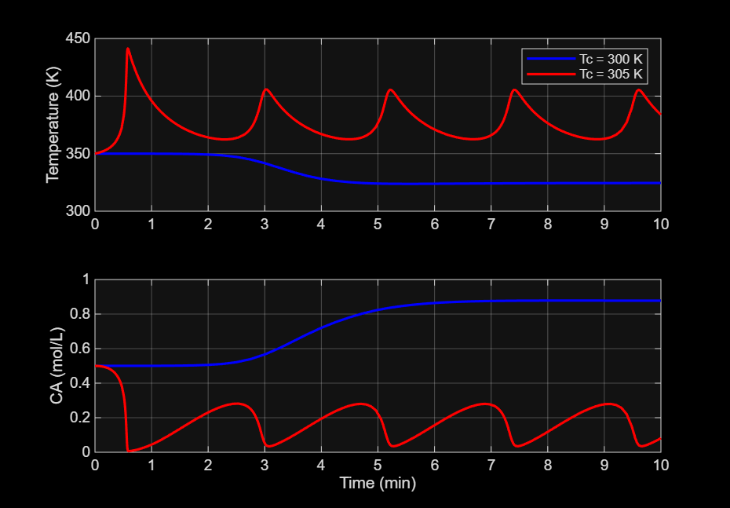
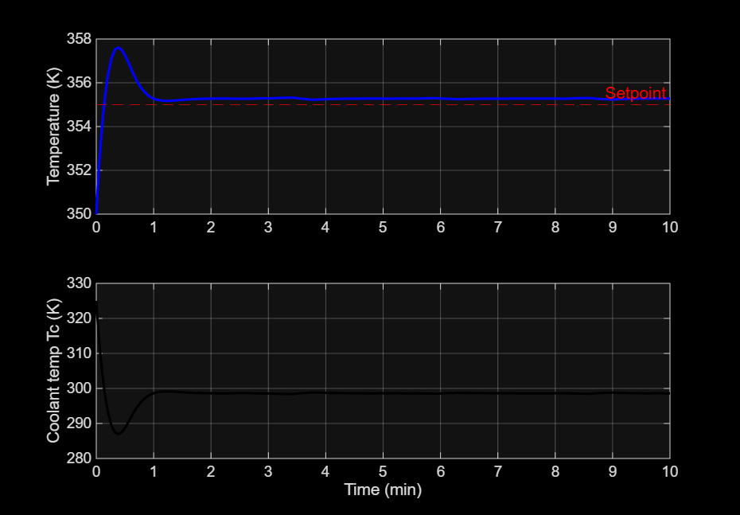
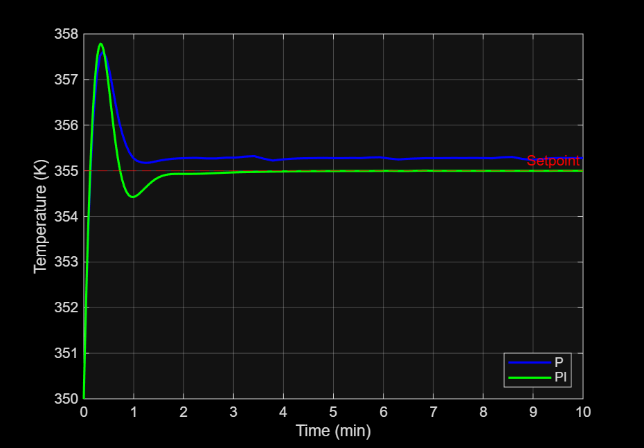
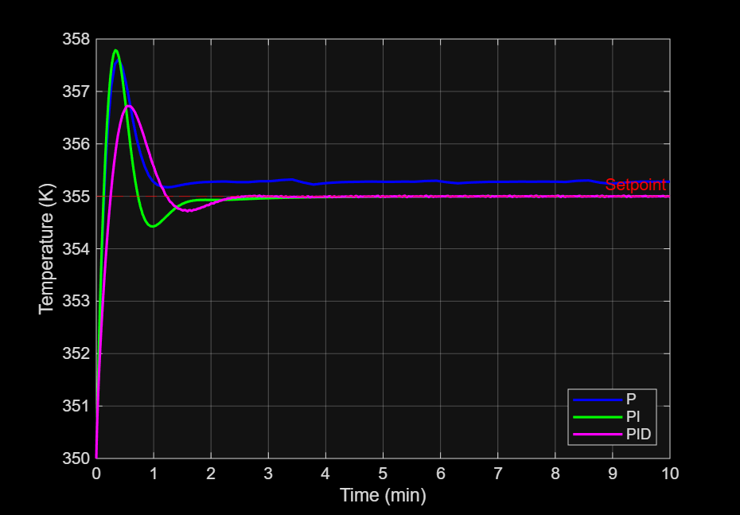
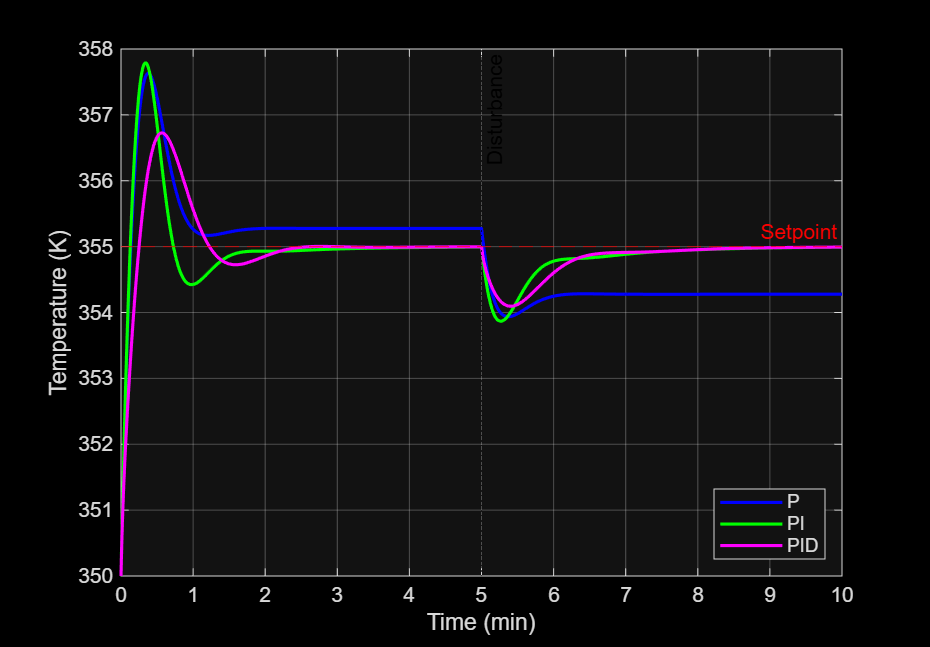

# CSTR-Temperature-Control
MATLAB simulation of P, PI and PID temperature control of an exothermic CSTR

# CSTR Temperature Control using P, PI and PID Controllers (MATLAB)

## Objective
Simulate a nonlinear exothermic CSTR (continuous stirred tank reactor) in MATLAB and compare P, PI and PID temperature control on a setpoint change and on a feed temperature disturbance.

## Tools
MATLAB, ODE45

## Method
1. Built the reactor model from the mass balance and energy balance (`cstr_model.m`).
2. Ran the open-loop response, which shows the reactor is unstable without a controller (`openloop.m`).
3. Added P, PI and PID controllers to hold the reactor at 355 K (`p_control.m`, `pi_control.m`, `pid_control.m`).
4. Tested a feed temperature drop from 350 K to 340 K at t = 5 min (`disturbance_test.m`, `cstr_model_d.m`).
5. Calculated overshoot, rise time, settling time and steady-state error (`metrics.m`).

## Results (setpoint change, 350 K to 355 K)

| Controller | Overshoot (K) | Overshoot (%) | Rise time (min) | Settling time (min) | Steady-state error (K) |
|---|---|---|---|---|---|
| P | 2.63 | 52.6 | 0.11 | 1.28 | -0.28 |
| PI | 2.79 | 55.8 | 0.10 | 1.61 | ~0 |
| PID | 1.73 | 34.5 | 0.20 | 2.12 | ~0 |

## Key Findings
- Without a controller, the reactor is open-loop unstable: the temperature oscillates and drifts.
- P control stabilizes the reactor but leaves a permanent offset.
- PI and PID remove the offset completely, including after the feed disturbance.
- PID gives the lowest overshoot of the controllers that remove the offset.

## Plots

## How to Run
Keep all files in one folder and run the scripts in this order: `openloop.m`, `p_control.m`, `pi_control.m`, `pid_control.m`, `disturbance_test.m`, `metrics.m`.

## Author
Roshni
